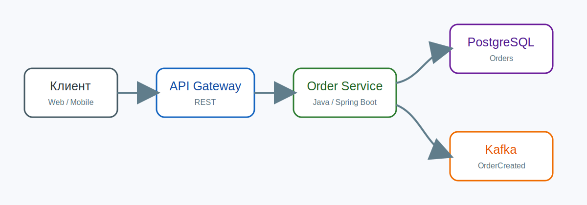

# ДЗ-1. Проектирование сервиса заказов

## Цель

Спроектировать упрощённую архитектуру сервиса заказов для учебной платформы доставки еды.

## Основные требования

- клиент создаёт заказ через REST API;
- сервис сохраняет заказ в PostgreSQL;
- после создания публикуется событие `OrderCreated`;
- внешний сервис оплаты может изменить статус заказа;
- архитектура должна быть понятна как на уровне C4, так и на уровне последовательности вызовов.

## Иллюстрация

## Результат

Ниже автоматически встроены материалы из каталогов `plantuml`, `structurizr` и `openapi`.
