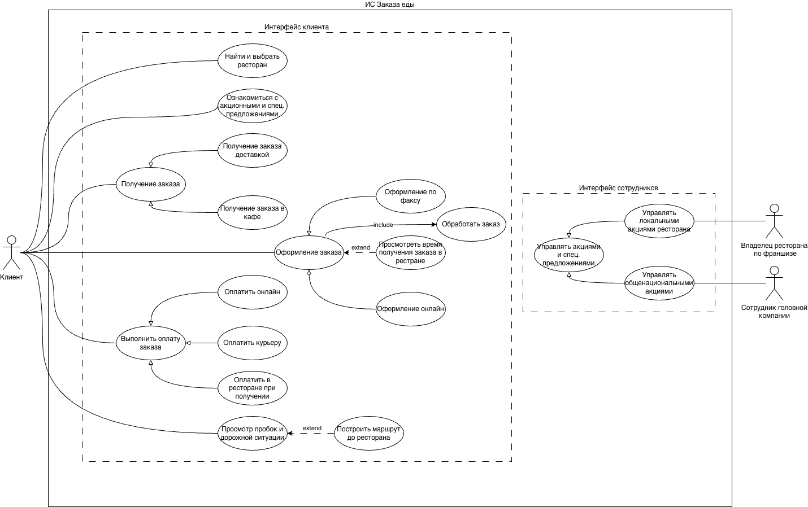
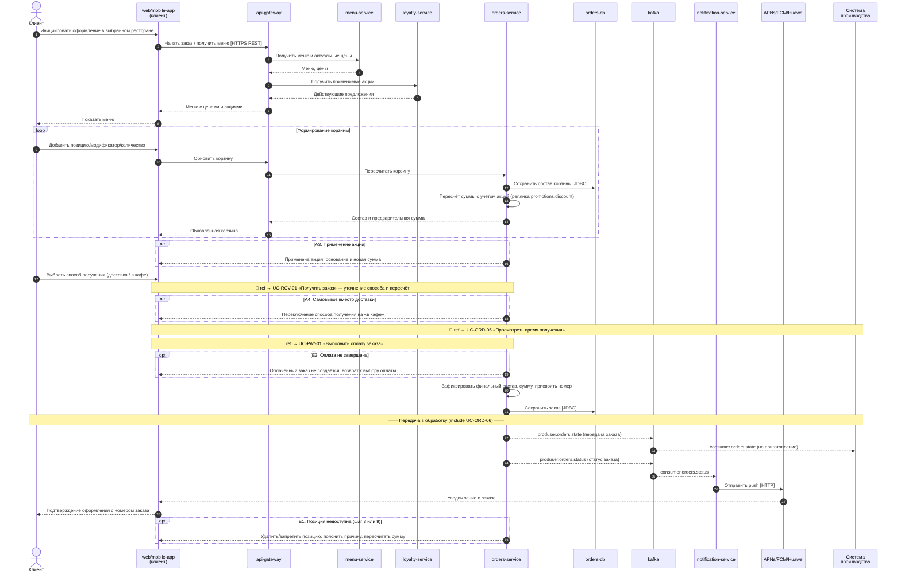

# Домашнее задание №1 · Микросервисная архитектура

## Система управления заказами «Заказ еды» (кейс BLT)

> **TL;DR.** Платформа управления заказами национальной сети сэндвич-ресторанов: поиск ресторана и меню, корзина и оформление заказа, оплата, доставка, лояльность и уведомления. Синхронный обмен — HTTP/JSON REST через `api-gateway`; асинхронный — события **Kafka**, входящие вебхуки внешних систем и push (APNs/FCM/HMS).

Это домашнее задание собрано как единый навигационный хаб: диаграмма прецедентов, 19 вариантов использования с **sequence-диаграммами**, паспорта 9 микросервисов и живые спецификации архитектуры (C4), REST (OpenAPI) и событий (AsyncAPI).

---

## Содержание

- [Живые артефакты](#-живые-артефакты) — C4 / OpenAPI / AsyncAPI
- [Акторы](#-акторы)
- [Диаграмма прецедентов](#-диаграмма-прецедентов)
- [Реестр вариантов использования](#-реестр-вариантов-использования) → полные спецификации в [`docs/use-cases.md`](./docs/use-cases.md)
- [Карта микросервисов](#-карта-микросервисов) → паспорта в [`docs/services.md`](./docs/services.md)
- [Пример sequence-диаграммы](#-пример-sequence-диаграммы)
- [Структура репозитория](#-структура-репозитория)

---

## 🔗 Живые артефакты

| Артефакт | Что показывает | Ссылка |
|---|---|---|
| **Архитектура (C4, Level 2)** | Контейнерная диаграмма системы в Structurizr: сервисы, хранилища, шина Kafka, внешние системы и связи между ними | **[Открыть Structurizr](https://pavelgr1408.github.io/architecture-homeworks/homeworks/dz-1/structurizr/#SystemLandscape-001)** |
| **REST API (OpenAPI 3.1)** | Синхронные интерфейсы всех сервисов + вебхуки, в Swagger UI | **[Открыть OpenAPI](https://pavelgr1408.github.io/architecture-homeworks/homeworks/dz-1/openapi/)** |
| **События (AsyncAPI 3.0)** | Каналы Kafka, продюсеры/консьюмеры, схемы сообщений | **[Открыть AsyncAPI](https://pavelgr1408.github.io/architecture-homeworks/homeworks/dz-1/asyncapi/kafka-events.html)** |

---

## 🎭 Акторы

| Актор | Роль |
|---|---|
| **Клиент** | Ищет ресторан, оформляет и оплачивает заказ, получает доставкой или в кафе, смотрит пробки и маршрут |
| **Владелец ресторана по франшизе** | Управляет локальными акциями своего ресторана |
| **Сотрудник головной компании** | Управляет общенациональными акциями сети |
| **Сотрудник кафе** | Оформляет заказы (в т. ч. по факсу), принимает оплату на кассе, отмечает выдачу |
| **Курьер** | Доставляет заказ, при необходимости принимает оплату |
| **Внешние картографические сервисы** | Геолокация, пробки, маршруты (Яндекс.Карты / Mapkit) |
| **Платёжный провайдер** | Обрабатывает онлайн-платежи; полные реквизиты карт не хранятся |

---

## 🗺 Диаграмма прецедентов



---

## 📋 Реестр вариантов использования

Полное текстовое описание каждого UC (карточка, условия завершения, основной сценарий, альтернативные и исключительные потоки) **и sequence-диаграмма** — в [`docs/use-cases.md`](./docs/use-cases.md). Названия ниже кликабельны.

| ID | Вариант использования | Связь / уровень |
|---|---|---|
| `UC-FND-01` | [Найти и выбрать ресторан](./docs/use-cases.md#uc-fnd-01-найти-и-выбрать-ресторан) | Пользовательская цель |
| `UC-PRM-01` | [Ознакомиться с акционными и специальными предложениями](./docs/use-cases.md#uc-prm-01-ознакомиться-с-акционными-и-специальными-предложениями) | Пользовательская цель |
| `UC-ORD-01` | [Оформить заказ](./docs/use-cases.md#uc-ord-01-оформить-заказ) | Обобщающий |
| `UC-ORD-02` | [Оформить заказ по факсу](./docs/use-cases.md#uc-ord-02-оформить-заказ-по-факсу) | спец. UC-ORD-01 |
| `UC-ORD-03` | [Оформить заказ онлайн](./docs/use-cases.md#uc-ord-03-оформить-заказ-онлайн) | спец. UC-ORD-01 |
| `UC-ORD-05` | [Просмотреть время получения заказа в ресторане](./docs/use-cases.md#uc-ord-05-просмотреть-время-получения-заказа-в-ресторане) | extend → UC-ORD-01 |
| `UC-ORD-06` | [Обработать заказ](./docs/use-cases.md#uc-ord-06-обработать-заказ) | include ← UC-ORD-01 |
| `UC-PAY-01` | [Выполнить оплату заказа](./docs/use-cases.md#uc-pay-01-выполнить-оплату-заказа) | Обобщающий |
| `UC-PAY-02` | [Оплатить онлайн](./docs/use-cases.md#uc-pay-02-оплатить-онлайн) | спец. UC-PAY-01 |
| `UC-PAY-03` | [Оплатить курьеру](./docs/use-cases.md#uc-pay-03-оплатить-курьеру) | спец. UC-PAY-01 |
| `UC-PAY-04` | [Оплатить в ресторане при получении](./docs/use-cases.md#uc-pay-04-оплатить-в-ресторане-при-получении) | спец. UC-PAY-01 |
| `UC-RCV-01` | [Получить заказ](./docs/use-cases.md#uc-rcv-01-получить-заказ) | Обобщающий |
| `UC-RCV-02` | [Получить заказ доставкой](./docs/use-cases.md#uc-rcv-02-получить-заказ-доставкой) | спец. UC-RCV-01 |
| `UC-RCV-03` | [Получить заказ в кафе](./docs/use-cases.md#uc-rcv-03-получить-заказ-в-кафе) | спец. UC-RCV-01 |
| `UC-MAP-01` | [Просмотреть пробки и дорожную ситуацию](./docs/use-cases.md#uc-map-01-просмотреть-пробки-и-дорожную-ситуацию) | Пользовательская цель |
| `UC-MAP-02` | [Построить маршрут до ресторана](./docs/use-cases.md#uc-map-02-построить-маршрут-до-ресторана) | extend → UC-MAP-01 |
| `UC-PRM-02` | [Управлять акциями и специальными предложениями](./docs/use-cases.md#uc-prm-02-управлять-акциями-и-специальными-предложениями) | Обобщающий |
| `UC-PRM-03` | [Управлять локальными акциями ресторана](./docs/use-cases.md#uc-prm-03-управлять-локальными-акциями-ресторана) | спец. UC-PRM-02 |
| `UC-PRM-04` | [Управлять общенациональными акциями](./docs/use-cases.md#uc-prm-04-управлять-общенациональными-акциями) | спец. UC-PRM-02 |

---

## 🧩 Карта микросервисов

9 микросервисов; полные паспорта (назначение, границы, предоставляемые и потребляемые интерфейсы, данные) — в [`docs/services.md`](./docs/services.md).

| # | Сервис | Bounded Context | Предоставляет (sync) | Публикует (Kafka) | Потребляет (Kafka) |
|---|---|---|---|---|---|
| 1 | `api-gateway` | Инфраструктура | Публичный REST-фасад платформы | — | — |
| 2 | `auth-service` | Идентификация и доступ | login, verify, authorize, me | — | — |
| 3 | `restaurant-service` | Рестораны | поиск, детали ресторана | — | — |
| 4 | `menu-service` | Меню | меню, валидация позиций | — | — |
| 5 | `loyalty-service` | Лояльность и акции | управление акциями | `promotions.discount` | — |
| 6 | `orders-service` | Заказы | корзина, заказы, ETA, выдача | `orders.state`, `orders.status` | `orders.payments.status`, `orders.dish.status`, `orders.delivery.status`, `promotions.discount`, `production.lead.time` |
| 7 | `payment-service` | Платежи | способы, платежи, POS + вебхуки | `orders.payments.status`, `orders.payments.link` | `orders.state`, `orders.status` |
| 8 | `delivery-service` | Доставка | инфо о доставке, координаты + вебхук | `orders.delivery.status` | `orders.state`, `orders.payments.link` |
| 9 | `notification-service` | Уведомления | push-токены | — | `orders.status` |

> **Внешние / общие системы** (паспорта не ведём): платёжный шлюз, кассовая система (POS), курьерская система, APNs/FCM/HMS, платформа карт, система производства.

---

## 🔄 Пример sequence-диаграммы

Диаграммы написаны на **Mermaid** и рендерятся прямо в Markdown на GitHub — без картинок. Ниже обобщающий сценарий **UC-ORD-01 «Оформить заказ»**; остальные 18 — в [`docs/use-cases.md`](./docs/use-cases.md).



---

## 📁 Структура репозитория

```
dz-1/
├── README.md                     ← этот файл (навигационный хаб ДЗ)
├── docs/
│   ├── use-cases.md              ← 19 вариантов использования: спецификации + Mermaid sequence-диаграммы
│   ├── services.md               ← паспорта 9 микросервисов (интеграционные интерфейсы)
│   └── SERVICE_TEMPLATE.md       ← шаблон паспорта сервиса
├── assets/
│   └── use-case-diagram.png      ← диаграмма прецедентов (UML)
└── diagrams/
    └── plantuml/
        └── use-cases.puml        ← исходники sequence-диаграмм (PlantUML, для провенанса)
```

Живые спецификации (Structurizr / OpenAPI / AsyncAPI) публикуются через GitHub Pages — ссылки в разделе [Живые артефакты](#-живые-артефакты).
