# Спецификации вариантов использования

> Информационная система **«Заказ еды»** — национальная сеть сэндвич-ресторанов (кейс BLT). Для каждого варианта использования приведены карточка, условия завершения, основной сценарий, альтернативные потоки, потоки исключений и **sequence-диаграмма** (Mermaid, рендерится прямо на GitHub).

[← На главную](../README.md) · [Паспорта сервисов →](./services.md)

---

# Контекст и границы системы

Национальная сеть сэндвич-ресторанов внедряет информационную систему
«Заказ еды», добавляющую оформление заказов через Интернет (в том числе
с мобильных устройств) при обязательном сохранении существующего канала
заказа по факсу. Система рассчитана на тысячи пользователей с
перспективой роста до миллионов и на последующий выход на международный
рынок.

## Ключевые требования, отражённые в спецификации

Спецификация покрывает функциональные требования кейса и увязывает их с
конкретными вариантами использования:

- Оформление заказа онлайн наравне с сохранённым каналом по факсу —
  UC-ORD-01/02/03.

<!-- -->

- Сообщение клиенту времени готовности заказа и маршрута до ресторана —
  UC-ORD-05, UC-MAP-02.

- Интеграция с несколькими внешними картографическими сервисами (пробки,
  дорожная ситуация, маршруты) — UC-MAP-01/02.

- Назначение курьера и организация доставки для ресторанов,
  предоставляющих эту услугу — UC-ORD-06, UC-RCV-02.

- Доступность с мобильных устройств — сквозное нефункциональное
  требование во всех клиентских UC.

- Общенациональные и локальные ежедневные акции и специальные
  предложения — UC-PRM-01/02/03/04.

- Оплата онлайн, при получении в ресторане и при доставке —
  UC-PAY-01/02/03/04.

## Акторы

|                                      |                                                                                                                                               |
|--------------------------------------|-----------------------------------------------------------------------------------------------------------------------------------------------|
| **Клиент**                           | Основной потребитель сервиса: ищет ресторан, оформляет и оплачивает заказ, получает его доставкой или в кафе, просматривает пробки и маршрут. |
| **Владелец ресторана по франшизе**   | Управляет локальными акциями своего ресторана. Каждый ресторан работает по франшизе и имеет собственного владельца.                           |
| **Сотрудник головной компании**      | Управляет общенациональными акциями и специальными предложениями сети.                                                                        |
| **Внешние картографические сервисы** | Поставляют данные о геолокации, дорожной ситуации, пробках и маршрутах; используются несколько сервисов с резервированием.                    |
| **Платёжный провайдер**              | Обрабатывает онлайн-платежи; система не хранит полные реквизиты карт.                                                                         |

## Дополнительный контекст (архитектурная карта)

|                              |                                                                                                                                                              |
|------------------------------|--------------------------------------------------------------------------------------------------------------------------------------------------------------|
| **Франшизная модель**        | Каждый ресторан имеет собственного владельца; полномочия по акциям разграничены между франшизой (локальные) и головной компанией (общенациональные).         |
| **Международное расширение** | Планируется в ближайшем будущем; интерфейсы и контент проектируются с учётом локализации (см. NFR в UC-ORD-01, UC-PRM-04).                                   |
| **Масштаб и доступность**    | Тысячи пользователей сегодня, потенциально миллионы; обязательная доступность с мобильных устройств.                                                         |
| **Корпоративная цель**       | Максимизация прибыли, в том числе за счёт найма недорогой рабочей силы; отражается требованием к простоте операций сотрудников и максимальной автоматизации. |

## Реестр вариантов использования

| **Идентификатор** | **Название**                                           | **Тип связи / уровень** |
|-------------------|--------------------------------------------------------|-------------------------|
| **UC-FND-01**     | Найти и выбрать ресторан                               | Пользовательская цель   |
| **UC-PRM-01**     | Ознакомиться с акционными и специальными предложениями | Пользовательская цель   |
| **UC-ORD-01**     | Оформить заказ                                         | Обобщающий сценарий     |
| **UC-ORD-02**     | Оформить заказ по факсу                                | Специализация UC-ORD-01 |
| **UC-ORD-03**     | Оформить заказ онлайн                                  | Специализация UC-ORD-01 |
| **UC-ORD-06**     | Обработать заказ                                       | include &le; UC-ORD-01   |
| **UC-ORD-05**     | Просмотреть время получения заказа в ресторане         | extend =&gt; UC-ORD-01    |
| **UC-RCV-01**     | Получить заказ                                         | Обобщающий сценарий     |
| **UC-RCV-02**     | Получить заказ доставкой                               | Специализация UC-RCV-01 |
| **UC-RCV-03**     | Получить заказ в кафе                                  | Специализация UC-RCV-01 |
| **UC-PAY-01**     | Выполнить оплату заказа                                | Обобщающий сценарий     |
| **UC-PAY-02**     | Оплатить онлайн                                        | Специализация UC-PAY-01 |
| **UC-PAY-03**     | Оплатить курьеру                                       | Специализация UC-PAY-01 |
| **UC-PAY-04**     | Оплатить в ресторане при получении                     | Специализация UC-PAY-01 |
| **UC-MAP-01**     | Просмотреть пробки и дорожную ситуацию                 | Пользовательская цель   |
| **UC-MAP-02**     | Построить маршрут до ресторана                         | extend =&gt; UC-MAP-01    |
| **UC-PRM-02**     | Управлять акциями и специальными предложениями         | Обобщающий сценарий     |
| **UC-PRM-03**     | Управлять локальными акциями ресторана                 | Специализация UC-PRM-02 |
| **UC-PRM-04**     | Управлять общенациональными акциями                    | Специализация UC-PRM-02 |

# Спецификации вариантов использования

Ниже приведено текстовое описание каждого варианта использования из
диаграммы, оформленное строго по эталонному шаблону: карточка, условия
завершения, основной успешный сценарий, альтернативные потоки, потоки
исключений и связанные требования.

---

## Диаграмма прецедентов

---

## UC-FND-01 «Найти и выбрать ресторан»

[↑ Реестр](../README.md#-реестр-вариантов-использования)

### Карточка варианта использования

|                   |                                                                   |
|-------------------|-------------------------------------------------------------------|
| **Идентификатор** | UC-FND-01                                                         |
| **Название**      | Найти и выбрать ресторан                                          |
| **Триггер**       | Клиент открывает приложение или сайт и запускает поиск ресторана. |

### Условия завершения

<table>
<colgroup>
<col style="width: 31%" />
<col style="width: 68%" />
</colgroup>
<tbody>
<tr class="odd">
<td><strong>Предусловия</strong></td>
<td>
P1. Справочник ресторанов сети с адресами, режимом работы и
услугами актуален.

P2. Клиент имеет доступ к приложению или сайту (в т. ч. с мобильного
устройства).
</td>
</tr>
<tr class="even">
<td><strong>Минимальные гарантии</strong></td>
<td>
MG1. Клиенту не предлагается закрытый или неактивный ресторан как
доступный для заказа.

MG2. При недоступности геолокации поиск остаётся работоспособным по
ручному вводу адреса или города.
</td>
</tr>
<tr class="odd">
<td><strong>Гарантии успеха</strong></td>
<td>
SG1. Выбран конкретный ресторан сети, определён его режим работы
и перечень услуг (доставка, самовывоз).

SG2. Выбранный ресторан зафиксирован как контекст для дальнейшего
оформления заказа.
</td>
</tr>
</tbody>
</table>

### Основной успешный сценарий

| **Шаг** | **Инициатор** | **Действие / наблюдаемый результат**                                                                                 |
|---------|---------------|----------------------------------------------------------------------------------------------------------------------|
| **1**   | Клиент        | Запускает поиск ресторана и предоставляет местоположение либо вводит адрес/город.                                    |
| **2**   | Система       | Определяет геопозицию через картографический сервис и подбирает подходящие рестораны сети.                           |
| **3**   | Система       | Отображает список ресторанов с адресом, расстоянием, режимом работы и признаком услуги доставки.                     |
| **4**   | Клиент        | Применяет фильтры (доставка, режим работы, часы) и уточняет выбор.                                                   |
| **5**   | Система       | Обновляет список в соответствии с фильтрами.                                                                         |
| **6**   | Клиент        | Выбирает конкретный ресторан.                                                                                        |
| **7**   | Система       | Фиксирует выбранный ресторан как контекст сессии и переходит к обзору меню и предложений. Use Case успешно завершён. |

### Альтернативные потоки

<table>
<colgroup>
<col style="width: 19%" />
<col style="width: 13%" />
<col style="width: 23%" />
<col style="width: 26%" />
<col style="width: 16%" />
</colgroup>
<thead>
<tr class="header">
<th><strong>Код и название</strong></th>
<th><strong>Точка ветвления</strong></th>
<th><strong>Условие</strong></th>
<th><strong>Шаги</strong></th>
<th><strong>Возврат / завершение</strong></th>
</tr>
</thead>
<tbody>
<tr class="odd">
<td><strong>A1. Ручной выбор без геолокации</strong></td>
<td>Шаг 1</td>
<td>Клиент отказал в доступе к местоположению</td>
<td>
A1.1. Система запрашивает город или адрес вручную.

A1.2. Клиент вводит данные.
</td>
<td>Перейти к шагу 2.</td>
</tr>
<tr class="even">
<td><strong>A2. Ресторан вне зоны обслуживания</strong></td>
<td>Шаг 3</td>
<td>Ни один ресторан не покрывает адрес доставки</td>
<td>A2.1. Система предлагает переключиться на самовывоз в ближайшем
ресторане.</td>
<td>Перейти к шагу 6.</td>
</tr>
</tbody>
</table>

### Потоки исключений

<table>
<colgroup>
<col style="width: 19%" />
<col style="width: 13%" />
<col style="width: 22%" />
<col style="width: 27%" />
<col style="width: 16%" />
</colgroup>
<thead>
<tr class="header">
<th><strong>Код и название</strong></th>
<th><strong>Точка возникновения</strong></th>
<th><strong>Ошибка / причина</strong></th>
<th><strong>Реакция системы</strong></th>
<th><strong>Результат</strong></th>
</tr>
</thead>
<tbody>
<tr class="odd">
<td><strong>E1. Картографический сервис недоступен</strong></td>
<td>Шаг 2</td>
<td>Тайм-аут или ошибка внешнего сервиса геокодирования</td>
<td>
E1.1. Система переключается на резервный картографический
сервис.

E1.2. При недоступности всех сервисов предлагает ручной ввод адреса и
поиск по справочнику.
</td>
<td>Возврат к шагу 1 в режиме ручного ввода.</td>
</tr>
<tr class="even">
<td><strong>E2. Справочник ресторанов пуст для района</strong></td>
<td>Шаг 3</td>
<td>Нет ни одного активного ресторана в радиусе поиска</td>
<td>E2.1. Система сообщает об отсутствии ресторанов и предлагает
расширить радиус или сменить адрес.</td>
<td>Возврат к шагу 1.</td>
</tr>
</tbody>
</table>

#

### Sequence-диаграмма

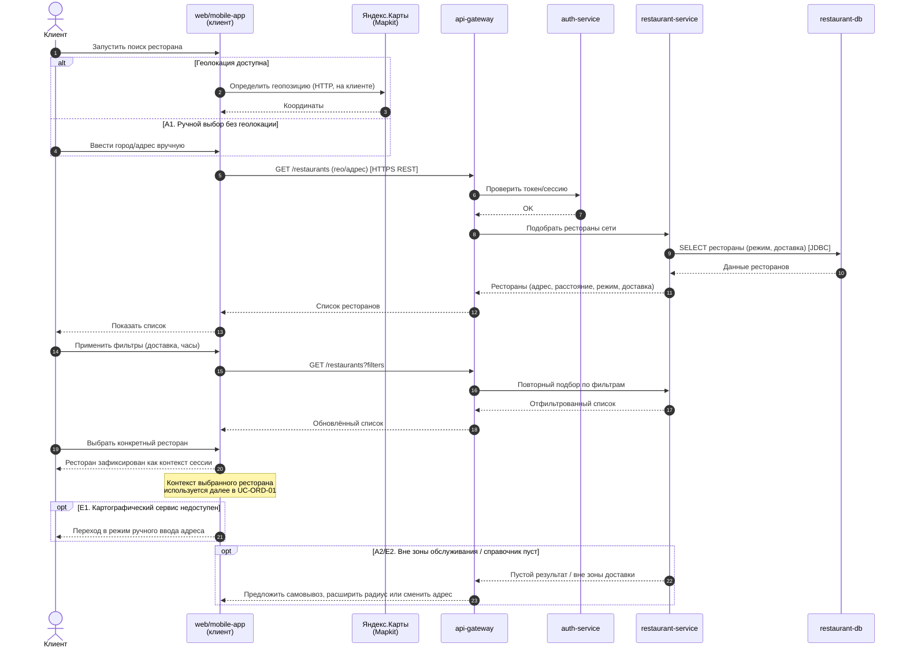

---

## UC-PRM-01 «Ознакомиться с акционными и специальными предложениями»

[↑ Реестр](../README.md#-реестр-вариантов-использования)

### Карточка варианта использования

|                   |                                                                                                      |
|-------------------|------------------------------------------------------------------------------------------------------|
| **Идентификатор** | UC-PRM-01                                                                                            |
| **Название**      | Ознакомиться с акционными и специальными предложениями                                               |
| **Триггер**       | Клиент открывает раздел акций и специальных предложений или просматривает меню выбранного ресторана. |

### Условия завершения

<table>
<colgroup>
<col style="width: 31%" />
<col style="width: 68%" />
</colgroup>
<tbody>
<tr class="odd">
<td><strong>Предусловия</strong></td>
<td>
P1. Выбран ресторан (UC-FND-01) либо определён регион
клиента.

P2. В подсистеме управления акциями заданы действующие
предложения.
</td>
</tr>
<tr class="even">
<td><strong>Минимальные гарантии</strong></td>
<td>MG1. Клиенту не показываются истёкшие или ещё не начавшиеся акции
как действующие.</td>
</tr>
<tr class="odd">
<td><strong>Гарантии успеха</strong></td>
<td>
SG1. Клиенту отображён актуальный перечень применимых акций:
общенациональных и локальных для выбранного ресторана.

SG2. По каждому предложению доступны условия применения и период
действия.
</td>
</tr>
</tbody>
</table>

### Основной успешный сценарий

| **Шаг** | **Инициатор** | **Действие / наблюдаемый результат**                                                                                         |
|---------|---------------|------------------------------------------------------------------------------------------------------------------------------|
| **1**   | Клиент        | Открывает перечень акций и специальных предложений.                                                                          |
| **2**   | Система       | Запрашивает у системы действующие предложения для региона и выбранного ресторана.                                            |
| **3**   | Система       | Объединяет общенациональные и локальные предложения, отсеивает недействующие и отображает их с условиями и сроками.          |
| **4**   | Клиент        | Просматривает интересующее предложение и его условия.                                                                        |
| **5**   | Система       | Отображает детали предложения и, при наличии, кнопку перехода к оформлению заказа с учётом акции. Use Case успешно завершён. |

### Альтернативные потоки

| **Код и название**                        | **Точка ветвления** | **Условие**            | **Шаги**                                                                                            | **Возврат / завершение** |
|-------------------------------------------|---------------------|------------------------|-----------------------------------------------------------------------------------------------------|--------------------------|
| **A1. Просмотр без выбранного ресторана** | Шаг 2               | Ресторан ещё не выбран | A1.1. Система показывает только общенациональные акции и предлагает выбрать ресторан для локальных. | Перейти к шагу 3.        |

### Потоки исключений

| **Код и название**                  | **Точка возникновения** | **Ошибка / причина**                              | **Реакция системы**                                                                                             | **Результат**                                                          |
|-------------------------------------|-------------------------|---------------------------------------------------|-----------------------------------------------------------------------------------------------------------------|------------------------------------------------------------------------|
| **E1. Подсистема акций недоступна** | Шаг 2                   | Тайм-аут или ошибка подсистемы управления акциями | E1.1. Система сообщает о временной недоступности предложений и не блокирует переход к меню и оформлению заказа. | Use Case завершён с деградацией; оформление заказа остаётся доступным. |

### Sequence-диаграмма

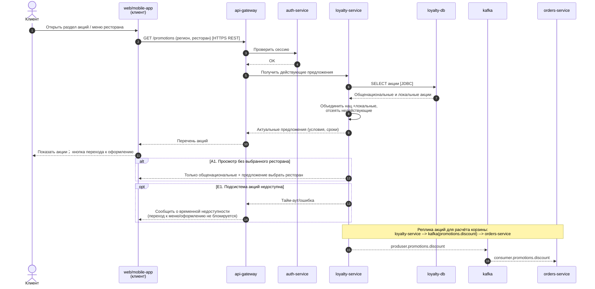

---

## UC-ORD-01 «Оформить заказ»

[↑ Реестр](../README.md#-реестр-вариантов-использования)

### Карточка варианта использования

|                   |                                                                       |
|-------------------|-----------------------------------------------------------------------|
| **Идентификатор** | UC-ORD-01                                                             |
| **Название**      | Оформить заказ                                                        |
| **Триггер**       | Клиент в контексте выбранного ресторана инициирует оформление заказа. |

### Условия завершения

<table>
<colgroup>
<col style="width: 31%" />
<col style="width: 68%" />
</colgroup>
<tbody>
<tr class="odd">
<td><strong>Предусловия</strong></td>
<td>
P1. Выбран ресторан (UC-FND-01), он открыт, меню и цены
актуальны.

P2. Клиенту доступен хотя бы один канал оформления (онлайн или
факс).
</td>
</tr>
<tr class="even">
<td><strong>Минимальные гарантии</strong></td>
<td>
MG1. Неподтверждённый или неоплаченный (для способов с
предоплатой) заказ не передаётся в производство.

MG2. При сбое на любом шаге сформированная корзина сохраняется,
повторное создание дублирующего заказа не выполняется.

MG3. Ключевые действия оформления журналируются с отметкой времени и
идентификатором заказа.
</td>
</tr>
<tr class="odd">
<td><strong>Гарантии успеха</strong></td>
<td>
SG1. Создан заказ с уникальным номером, финальным составом и
стоимостью с учётом применённых акций.

SG2. Определён способ получения (доставка или в кафе) и способ
оплаты.

SG3. Клиенту сообщено время готовности/получения (через UC-ORD-05) и,
при необходимости, маршрут до ресторана.

SG4. Заказ передан в обработку (UC-ORD-02).
</td>
</tr>
</tbody>
</table>

### Основной успешный сценарий

| **Шаг** | **Инициатор** | **Действие / наблюдаемый результат**                                                                                          |
|---------|---------------|-------------------------------------------------------------------------------------------------------------------------------|
| **1**   | Клиент        | Инициирует оформление заказа в выбранном ресторане.                                                                           |
| **2**   | Система       | Отображает меню с актуальными ценами и действующими предложениями.                                                            |
| **3**   | Клиент        | Добавляет позиции, модификаторы и количество в корзину.                                                                       |
| **4**   | Система       | Обновляет состав корзины и предварительную сумму с учётом применимых акций.                                                   |
| **5**   | Клиент        | Выбирает способ получения заказа: доставкой или в кафе (см. UC-RCV-01).                                                       |
| **6**   | Система       | Уточняет параметры получения (адрес доставки либо самовывоз) и пересчитывает условия.                                         |
| **7**   | Система       | Сообщает клиенту время, к которому можно забрать заказ / ожидать доставку (расширение UC-ORD-05).                             |
| **8**   | Клиент        | Выбирает способ оплаты и выполняет оплату (см. UC-PAY-01).                                                                    |
| **9**   | Система       | Фиксирует финальный состав, сумму, способ получения и оплаты, присваивает заказу уникальный номер.                            |
| **10**  | Система       | Передаёт заказ в обработку (include UC-ORD-02) и подтверждает клиенту оформление с номером заказа. Use Case успешно завершён. |

### Альтернативные потоки

<table>
<colgroup>
<col style="width: 19%" />
<col style="width: 13%" />
<col style="width: 23%" />
<col style="width: 26%" />
<col style="width: 16%" />
</colgroup>
<thead>
<tr class="header">
<th><strong>Код и название</strong></th>
<th><strong>Точка ветвления</strong></th>
<th><strong>Условие</strong></th>
<th><strong>Шаги</strong></th>
<th><strong>Возврат / завершение</strong></th>
</tr>
</thead>
<tbody>
<tr class="odd">
<td><strong>A1. Оформление онлайн</strong></td>
<td>Шаг 1</td>
<td>Клиент использует приложение или сайт (специализация UC-ORD-03)</td>
<td>A1.1. Клиент проходит шаги 2–10 в онлайн-канале в режиме
самообслуживания.</td>
<td>Успешное завершение по шагу 10.</td>
</tr>
<tr class="even">
<td><strong>A2. Оформление по факсу</strong></td>
<td>Шаг 1</td>
<td>Клиент оформляет заказ по факсу (специализация UC-ORD-02 канала
«факс»)</td>
<td>
A2.1. Клиент направляет заказ по факсу.

A2.2. Сотрудник ресторана вводит заказ в систему от имени клиента,
проходя шаги 2–10.
</td>
<td>Успешное завершение по шагу 10.</td>
</tr>
<tr class="odd">
<td><strong>A3. Применение акции</strong></td>
<td>После шага 4</td>
<td>Корзина удовлетворяет условиям действующей акции (BR-PRM-001)</td>
<td>A3.1. Система применяет предложение и отображает основание и новую
сумму.</td>
<td>Продолжить с шага 5.</td>
</tr>
<tr class="even">
<td><strong>A4. Самовывоз вместо доставки</strong></td>
<td>Шаг 5</td>
<td>Ресторан не предоставляет доставку либо клиент выбрал самовывоз</td>
<td>A4.1. Система переключает способ получения на «в кафе».</td>
<td>Продолжить с шага 6.</td>
</tr>
</tbody>
</table>

### Потоки исключений

| **Код и название**                            | **Точка возникновения** | **Ошибка / причина**                                       | **Реакция системы**                                                                              | **Результат**                      |
|-----------------------------------------------|-------------------------|------------------------------------------------------------|--------------------------------------------------------------------------------------------------|------------------------------------|
| **E1. Позиция недоступна**                    | Шаг 3 или 9             | Позиция снята с продажи или закончилась                    | E1.1. Система удаляет/запрещает позицию, объясняет причину и пересчитывает сумму.                | Возврат к шагу 2.                  |
| **E2. Ресторан закрылся во время оформления** | Шаг 9                   | Ресторан перешёл в статус «Закрыт»                         | E2.1. Система блокирует подтверждение и предлагает выбрать другой ресторан или отложенное время. | Возврат к UC-FND-01 либо к шагу 5. |
| **E3. Оплата не завершена**                   | Шаг 8                   | Отказ или неизвестный статус оплаты (детально в UC-PAY-01) | E3.1. Система не создаёт оплаченный заказ и возвращает клиента к выбору способа оплаты.          | Возврат к шагу 8.                  |

### Sequence-диаграмма

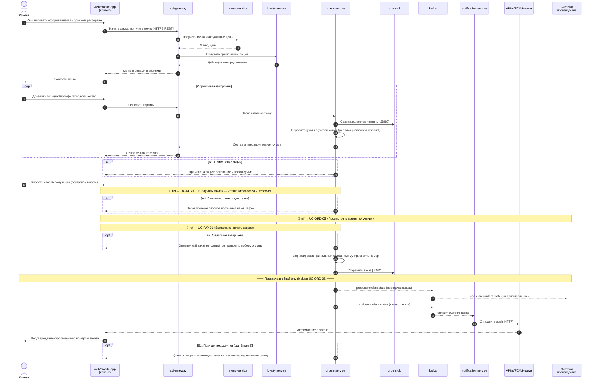

---

## UC-ORD-02 «Оформить заказ по факсу»

[↑ Реестр](../README.md#-реестр-вариантов-использования)

### Карточка варианта использования

|                   |                                                        |
|-------------------|--------------------------------------------------------|
| **Идентификатор** | UC-ORD-02                                              |
| **Название**      | Оформить заказ по факсу                                |
| **Триггер**       | Клиент отправляет заказ по факсу в выбранный ресторан. |

### Условия завершения

<table>
<colgroup>
<col style="width: 31%" />
<col style="width: 68%" />
</colgroup>
<tbody>
<tr class="odd">
<td><strong>Предусловия</strong></td>
<td>
P1. Ресторан открыт и принимает факсимильные заказы.

P2. Сотрудник ресторана имеет доступ к системе ввода
заказов.
</td>
</tr>
<tr class="even">
<td><strong>Минимальные гарантии</strong></td>
<td>
MG1. Некорректно распознанный факс не приводит к созданию заказа
без подтверждения состава.

MG2. Факсимильный заказ регистрируется в системе так же, как
онлайн-заказ.
</td>
</tr>
<tr class="odd">
<td><strong>Гарантии успеха</strong></td>
<td>
SG1. По факсимильному заказу создан заказ в системе с уникальным
номером.

SG2. Заказ передан в обработку наравне с онлайн-заказами.
</td>
</tr>
</tbody>
</table>

### Основной успешный сценарий

| **Шаг** | **Инициатор**       | **Действие / наблюдаемый результат**                                                                                            |
|---------|---------------------|---------------------------------------------------------------------------------------------------------------------------------|
| **1**   | Клиент              | Отправляет заказ по факсу с указанием состава и контактных данных.                                                              |
| **2**   | Сотрудник ресторана | Получает факс и вводит состав заказа в систему от имени клиента.                                                                |
| **3**   | Система             | Проверяет позиции по актуальному меню и отображает сумму.                                                                       |
| **4**   | Сотрудник ресторана | Уточняет у клиента способ получения и оплаты и фиксирует их.                                                                    |
| **5**   | Система             | Создаёт заказ с уникальным номером и передаёт его в обработку (UC-ORD-02 общий поток обработки — UC-ORD-06 «Обработать заказ»). |
| **6**   | Система             | Возвращает сотруднику номер заказа и время готовности для передачи клиенту. Use Case успешно завершён.                          |

### Альтернативные потоки

| **Код и название**            | **Точка ветвления** | **Условие**             | **Шаги**                                                  | **Возврат / завершение** |
|-------------------------------|---------------------|-------------------------|-----------------------------------------------------------|--------------------------|
| **A1. Уточнение по телефону** | Шаг 2               | Факс распознан частично | A1.1. Сотрудник связывается с клиентом и уточняет состав. | Продолжить с шага 3.     |

### Потоки исключений

| **Код и название**         | **Точка возникновения** | **Ошибка / причина**                    | **Реакция системы**                                                            | **Результат**                   |
|----------------------------|-------------------------|-----------------------------------------|--------------------------------------------------------------------------------|---------------------------------|
| **E1. Позиция недоступна** | Шаг 3                   | Позиция снята с продажи                 | E1.1. Система запрещает позицию; сотрудник согласует замену с клиентом.        | Возврат к шагу 2.               |
| **E2. Факс нечитаем**      | Шаг 2                   | Плохое качество факсимильного сообщения | E2.1. Сотрудник запрашивает повторную отправку или уточняет заказ по телефону. | Повтор шага 1 или переход к A1. |

### Sequence-диаграмма

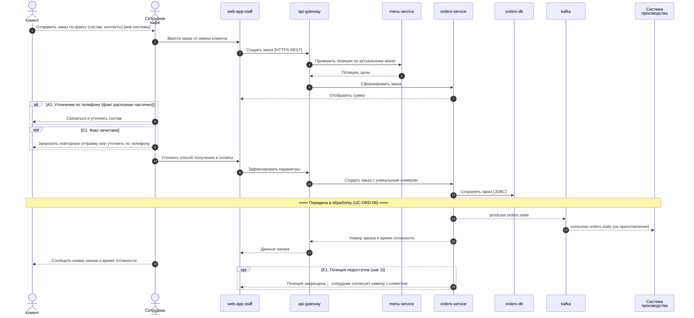

---

## UC-ORD-03 «Оформить заказ онлайн»

[↑ Реестр](../README.md#-реестр-вариантов-использования)

### Карточка варианта использования

|                   |                                                             |
|-------------------|-------------------------------------------------------------|
| **Идентификатор** | UC-ORD-03                                                   |
| **Название**      | Оформить заказ онлайн                                       |
| **Триггер**       | Клиент в приложении или на сайте нажимает «Оформить заказ». |

### Условия завершения

<table>
<colgroup>
<col style="width: 31%" />
<col style="width: 68%" />
</colgroup>
<tbody>
<tr class="odd">
<td><strong>Предусловия</strong></td>
<td>
P1. Выбран ресторан (UC-FND-01), он открыт, меню актуально.

P2. Клиент имеет доступ к онлайн-каналу.
</td>
</tr>
<tr class="even">
<td><strong>Минимальные гарантии</strong></td>
<td>
MG1. Незавершённый онлайн-заказ сохраняется в корзине без
создания дубликатов.

MG2. Для способов с предоплатой заказ не подтверждается до успешной
оплаты.
</td>
</tr>
<tr class="odd">
<td><strong>Гарантии успеха</strong></td>
<td>
SG1. Заказ создан онлайн с уникальным номером и финальной
суммой.

SG2. Заказ передан в обработку; клиенту показаны номер и время
готовности.
</td>
</tr>
</tbody>
</table>

### Основной успешный сценарий

| **Шаг** | **Инициатор** | **Действие / наблюдаемый результат**                                                                  |
|---------|---------------|-------------------------------------------------------------------------------------------------------|
| **1**   | Клиент        | Нажимает «Оформить заказ» и формирует корзину из позиций меню.                                        |
| **2**   | Система       | Отображает состав, сумму и применимые акции в реальном времени.                                       |
| **3**   | Клиент        | Выбирает способ получения (доставка/в кафе) и, при доставке, указывает адрес.                         |
| **4**   | Система       | Показывает время готовности/доставки (расширение UC-ORD-05).                                          |
| **5**   | Клиент        | Выбирает способ оплаты и подтверждает заказ (UC-PAY-01).                                              |
| **6**   | Система       | Создаёт заказ, передаёт в обработку (UC-ORD-06) и показывает номер заказа. Use Case успешно завершён. |

### Альтернативные потоки

| **Код и название**          | **Точка ветвления** | **Условие**           | **Шаги**                                                                            | **Возврат / завершение** |
|-----------------------------|---------------------|-----------------------|-------------------------------------------------------------------------------------|--------------------------|
| **A1. Гостевое оформление** | Шаг 1               | Клиент не авторизован | A1.1. Система позволяет оформить заказ без регистрации, запросив контактные данные. | Продолжить с шага 2.     |

### Потоки исключений

| **Код и название**        | **Точка возникновения** | **Ошибка / причина**               | **Реакция системы**                                                              | **Результат**               |
|---------------------------|-------------------------|------------------------------------|----------------------------------------------------------------------------------|-----------------------------|
| **E1. Потеря соединения** | Любой шаг               | Обрыв сети на мобильном устройстве | E1.1. Система сохраняет корзину и позволяет продолжить с места прерывания.       | Возврат к прерванному шагу. |
| **E2. Оплата отклонена**  | Шаг 5                   | Отказ платёжного провайдера        | E2.1. Система не создаёт заказ и предлагает повторить оплату или сменить способ. | Возврат к шагу 5.           |

### Sequence-диаграмма

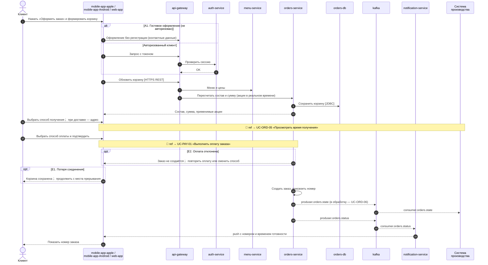

---

## UC-ORD-06 «Обработать заказ»

[↑ Реестр](../README.md#-реестр-вариантов-использования)

### Карточка варианта использования

|                   |                                                                                |
|-------------------|--------------------------------------------------------------------------------|
| **Идентификатор** | UC-ORD-06                                                                      |
| **Название**      | Обработать заказ                                                               |
| **Триггер**       | Оформление заказа (UC-ORD-01/02/03) передаёт подтверждённый заказ в обработку. |

### Условия завершения

<table>
<colgroup>
<col style="width: 31%" />
<col style="width: 68%" />
</colgroup>
<tbody>
<tr class="odd">
<td><strong>Предусловия</strong></td>
<td>P1. Заказ создан, имеет уникальный номер и подтверждён (и оплачен
для способов с предоплатой).</td>
</tr>
<tr class="even">
<td><strong>Минимальные гарантии</strong></td>
<td>
MG1. Дублирующая передача того же заказа не создаёт повторный
заказ в производстве (идемпотентность).

MG2. Заказ, не прошедший валидацию, не попадает в производство и
возвращается с причиной.
</td>
</tr>
<tr class="odd">
<td><strong>Гарантии успеха</strong></td>
<td>
SG1. Заказ принят рестораном и поставлен в очередь
производства.

SG2. Для доставки инициировано назначение курьера (UC-RCV-02).

SG3. Клиенту доступен актуальный статус заказа и время
готовности.
</td>
</tr>
</tbody>
</table>

### Основной успешный сценарий

| **Шаг** | **Инициатор** | **Действие / наблюдаемый результат**                                                  |
|---------|---------------|---------------------------------------------------------------------------------------|
| **1**   | Система       | Получает оформленный заказ с составом, способом получения и оплаты.                   |
| **2**   | Система       | Валидирует заказ: состав, доступность позиций, статус оплаты, режим работы ресторана. |
| **3**   | Система       | Регистрирует заказ в очереди производства выбранного ресторана.                       |
| **4**   | Система       | Определяет способ получения; при доставке инициирует назначение курьера.              |
| **5**   | Система       | Рассчитывает и публикует время готовности/доставки и статус заказа.                   |
| **6**   | Система       | Подтверждает вызывающему сценарию успешную обработку. Use Case успешно завершён.      |

### Альтернативные потоки

| **Код и название**        | **Точка ветвления** | **Условие**                                                | **Шаги**                                                             | **Возврат / завершение** |
|---------------------------|---------------------|------------------------------------------------------------|----------------------------------------------------------------------|--------------------------|
| **A1. Заказ на доставку** | Шаг 4               | Ресторан предоставляет доставку и выбран способ «доставка» | A1.1. Система назначает курьера и передаёт заказ в маршрут доставки. | Продолжить с шага 5.     |
| **A2. Самовывоз**         | Шаг 4               | Выбран способ «в кафе»                                     | A2.1. Система помечает заказ как самовывоз без назначения курьера.   | Продолжить с шага 5.     |

### Потоки исключений

| **Код и название**                      | **Точка возникновения** | **Ошибка / причина**                                 | **Реакция системы**                                                                                    | **Результат**                                          |
|-----------------------------------------|-------------------------|------------------------------------------------------|--------------------------------------------------------------------------------------------------------|--------------------------------------------------------|
| **E1. Валидация не пройдена**           | Шаг 2                   | Позиция недоступна или оплата не подтверждена        | E1.1. Система не ставит заказ в производство и возвращает причину в оформление.                        | Отмена обработки; возврат в оформление.                |
| **E2. Нет доступного курьера**          | Шаг 4                   | Все курьеры заняты либо доставка временно невозможна | E2.1. Система ставит назначение в очередь и уведомляет о возможной задержке либо предлагает самовывоз. | Продолжение с задержкой или переключение на самовывоз. |
| **E3. Очередь производства недоступна** | Шаг 3                   | Сбой подсистемы производства ресторана               | E3.1. Система удерживает заказ и повторяет постановку; при длительном сбое эскалирует инцидент.        | Повтор шага 3; заказ не теряется.                      |

### Sequence-диаграмма

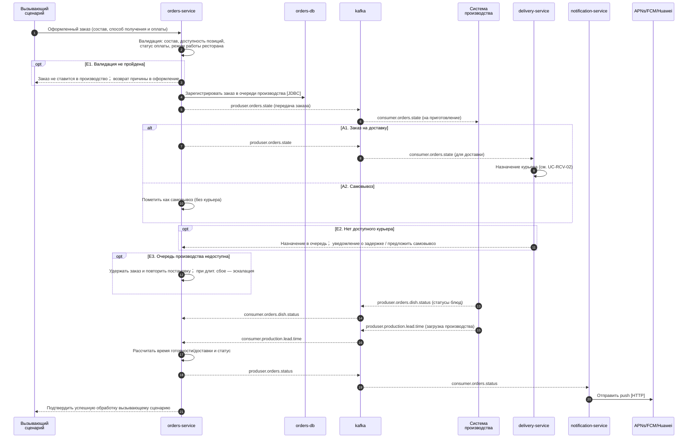

---

## UC-ORD-05 «Просмотреть время получения заказа в ресторане»

[↑ Реестр](../README.md#-реестр-вариантов-использования)

### Карточка варианта использования

|                   |                                                                                          |
|-------------------|------------------------------------------------------------------------------------------|
| **Идентификатор** | UC-ORD-05                                                                                |
| **Название**      | Просмотреть время получения заказа в ресторане                                           |
| **Триггер**       | В процессе оформления заказа клиент запрашивает время готовности (расширение UC-ORD-01). |

### Условия завершения

|                          |                                                                                                           |
|--------------------------|-----------------------------------------------------------------------------------------------------------|
| **Предусловия**          | P1. Сформирован состав заказа и выбран ресторан.                                                          |
| **Минимальные гарантии** | MG1. Клиенту не показывается заведомо недостижимое время готовности.                                      |
| **Гарантии успеха**      | SG1. Клиенту показано ориентировочное время готовности заказа к получению в ресторане или время доставки. |

### Основной успешный сценарий

| **Шаг** | **Инициатор** | **Действие / наблюдаемый результат**                                                      |
|---------|---------------|-------------------------------------------------------------------------------------------|
| **1**   | Клиент        | Запрашивает время получения заказа.                                                       |
| **2**   | Система       | Оценивает загрузку производства ресторана и состав заказа.                                |
| **3**   | Система       | Рассчитывает и отображает ориентировочное время готовности (для самовывоза) или доставки. |
| **4**   | Клиент        | Учитывает время и продолжает оформление. Use Case успешно завершён.                       |

### Альтернативные потоки

| **Код и название**       | **Точка ветвления** | **Условие**                       | **Шаги**                                                                               | **Возврат / завершение**                     |
|--------------------------|---------------------|-----------------------------------|----------------------------------------------------------------------------------------|----------------------------------------------|
| **A1. Отложенное время** | Шаг 3               | Клиент хочет получить заказ позже | A1.1. Система предлагает выбрать желаемый интервал получения в пределах режима работы. | Возврат к оформлению с выбранным интервалом. |

### Потоки исключений

| **Код и название**        | **Точка возникновения** | **Ошибка / причина**                | **Реакция системы**                                                                  | **Результат**                       |
|---------------------------|-------------------------|-------------------------------------|--------------------------------------------------------------------------------------|-------------------------------------|
| **E1. Оценка недоступна** | Шаг 2                   | Подсистема производства не отвечает | E1.1. Система показывает типовое (усреднённое) время с пометкой о приблизительности. | Продолжение оформления с оговоркой. |

### Sequence-диаграмма

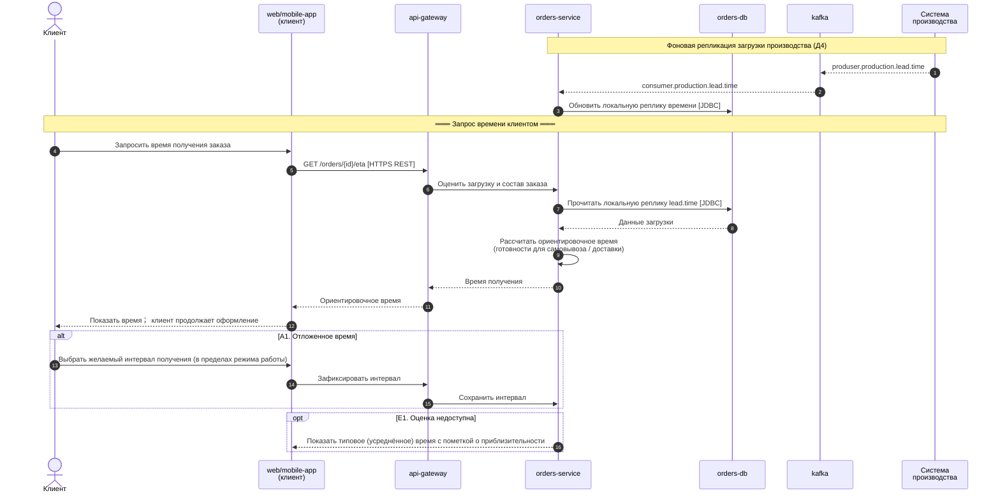

---

## UC-RCV-01 «Получить заказ»

[↑ Реестр](../README.md#-реестр-вариантов-использования)

### Карточка варианта использования

|                   |                                                         |
|-------------------|---------------------------------------------------------|
| **Идентификатор** | UC-RCV-01                                               |
| **Название**      | Получить заказ                                          |
| **Триггер**       | Заказ готов, и наступает момент его получения клиентом. |

### Условия завершения

|                          |                                                                         |
|--------------------------|-------------------------------------------------------------------------|
| **Предусловия**          | P1. Заказ оформлен и обработан (UC-ORD-06), способ получения определён. |
| **Минимальные гарантии** | MG1. Заказ не отмечается выданным без фактического получения клиентом.  |
| **Гарантии успеха**      | SG1. Заказ передан клиенту выбранным способом и отмечен как выданный.   |

### Основной успешный сценарий

| **Шаг** | **Инициатор** | **Действие / наблюдаемый результат**                                           |
|---------|---------------|--------------------------------------------------------------------------------|
| **1**   | Система       | Уведомляет клиента о готовности заказа и подтверждает способ получения.        |
| **2**   | Клиент        | Получает заказ выбранным способом (доставкой — UC-RCV-02, в кафе — UC-RCV-03). |
| **3**   | Система       | Фиксирует факт выдачи и закрывает заказ. Use Case успешно завершён.            |

### Альтернативные потоки

| **Код и название**          | **Точка ветвления** | **Условие**                                          | **Шаги**                                                | **Возврат / завершение**       |
|-----------------------------|---------------------|------------------------------------------------------|---------------------------------------------------------|--------------------------------|
| **A1. Получение доставкой** | Шаг 2               | Выбран способ «доставка» и ресторан её предоставляет | A1.1. Выполняется UC-RCV-02 «Получить заказ доставкой». | Успешное завершение по шагу 3. |
| **A2. Получение в кафе**    | Шаг 2               | Выбран способ «в кафе» (самовывоз)                   | A2.1. Выполняется UC-RCV-03 «Получить заказ в кафе».    | Успешное завершение по шагу 3. |

### Потоки исключений

| **Код и название**                    | **Точка возникновения** | **Ошибка / причина**                               | **Реакция системы**                                                             | **Результат**                             |
|---------------------------------------|-------------------------|----------------------------------------------------|---------------------------------------------------------------------------------|-------------------------------------------|
| **E1. Клиент не явился / недоступен** | Шаг 2                   | Клиент не забрал заказ или недоступен для доставки | E1.1. Система фиксирует неполучение по правилам ресторана и уведомляет клиента. | Заказ закрывается по правилу неполучения. |

### Sequence-диаграмма

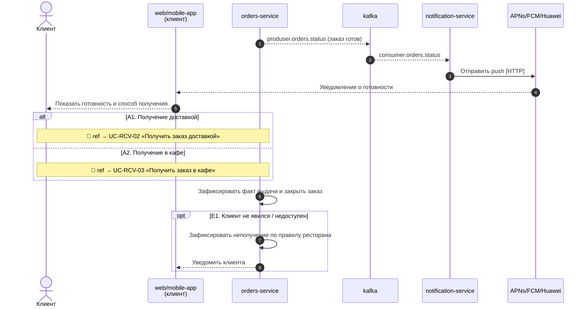

---

## UC-RCV-02 «Получить заказ доставкой»

[↑ Реестр](../README.md#-реестр-вариантов-использования)

### Карточка варианта использования

|                   |                                                          |
|-------------------|----------------------------------------------------------|
| **Идентификатор** | UC-RCV-02                                                |
| **Название**      | Получить заказ доставкой                                 |
| **Триггер**       | Обработанный заказ на доставку готов к передаче курьеру. |

### Условия завершения

<table>
<colgroup>
<col style="width: 31%" />
<col style="width: 68%" />
</colgroup>
<tbody>
<tr class="odd">
<td><strong>Предусловия</strong></td>
<td>
P1. Ресторан предоставляет услугу доставки.

P2. Заказ оплачен онлайн либо выбран способ «оплата курьеру»
(UC-PAY-03).
</td>
</tr>
<tr class="even">
<td><strong>Минимальные гарантии</strong></td>
<td>MG1. Заказ не отмечается доставленным без подтверждения передачи
клиенту.</td>
</tr>
<tr class="odd">
<td><strong>Гарантии успеха</strong></td>
<td>
SG1. Курьер назначен, заказ доставлен по адресу и отмечен как
выданный.

SG2. При оплате при доставке платёж зафиксирован.
</td>
</tr>
</tbody>
</table>

### Основной успешный сценарий

| **Шаг** | **Инициатор** | **Действие / наблюдаемый результат**                                    |
|---------|---------------|-------------------------------------------------------------------------|
| **1**   | Система       | Назначает курьера на заказ и строит маршрут до адреса клиента.          |
| **2**   | Курьер        | Забирает заказ в ресторане и выдвигается по маршруту.                   |
| **3**   | Клиент        | Отслеживает статус доставки и встречает курьера.                        |
| **4**   | Клиент        | Получает заказ; при выбранном способе — оплачивает курьеру (UC-PAY-03). |
| **5**   | Система       | Фиксирует доставку и закрывает заказ. Use Case успешно завершён.        |

### Альтернативные потоки

| **Код и название**                  | **Точка ветвления** | **Условие**                      | **Шаги**                                       | **Возврат / завершение** |
|-------------------------------------|---------------------|----------------------------------|------------------------------------------------|--------------------------|
| **A1. Оплата уже выполнена онлайн** | Шаг 4               | Заказ оплачен онлайн (UC-PAY-02) | A1.1. Курьер передаёт заказ без приёма оплаты. | Продолжить с шага 5.     |

### Потоки исключений

| **Код и название**                  | **Точка возникновения** | **Ошибка / причина**                    | **Реакция системы**                                                                                | **Результат**                           |
|-------------------------------------|-------------------------|-----------------------------------------|----------------------------------------------------------------------------------------------------|-----------------------------------------|
| **E1. Клиент недоступен по адресу** | Шаг 3–4                 | Клиент не отвечает или адрес недоступен | E1.1. Курьер фиксирует неудачу доставки; система применяет правило ресторана и уведомляет клиента. | Закрытие по правилу неудачной доставки. |
| **E2. Нет доступного курьера**      | Шаг 1                   | Все курьеры заняты                      | E2.1. Система ставит заказ в очередь назначения и уведомляет о задержке либо предлагает самовывоз. | Задержка или переключение на UC-RCV-03. |

### Sequence-диаграмма

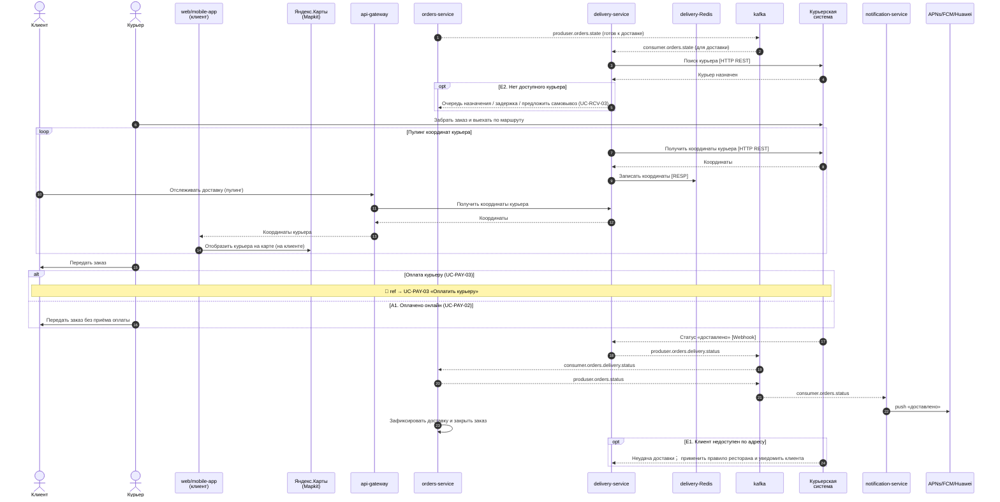

---

## UC-RCV-03 «Получить заказ в кафе»

[↑ Реестр](../README.md#-реестр-вариантов-использования)

### Карточка варианта использования

|                   |                                                         |
|-------------------|---------------------------------------------------------|
| **Идентификатор** | UC-RCV-03                                               |
| **Название**      | Получить заказ в кафе                                   |
| **Триггер**       | Заказ готов к самовывозу, и клиент приходит в ресторан. |

### Условия завершения

|                          |                                                                     |
|--------------------------|---------------------------------------------------------------------|
| **Предусловия**          | P1. Выбран способ получения «в кафе» и заказ обработан (UC-ORD-06). |
| **Минимальные гарантии** | MG1. Заказ выдаётся только по корректному номеру/подтверждению.     |
| **Гарантии успеха**      | SG1. Клиент получил заказ в ресторане; заказ отмечен как выданный.  |

### Основной успешный сценарий

| **Шаг** | **Инициатор**       | **Действие / наблюдаемый результат**                                            |
|---------|---------------------|---------------------------------------------------------------------------------|
| **1**   | Система             | Уведомляет клиента о готовности заказа к самовывозу и показывает номер и время. |
| **2**   | Клиент              | Приходит в ресторан и называет номер заказа.                                    |
| **3**   | Сотрудник ресторана | Сверяет номер и выдаёт заказ; при необходимости принимает оплату (UC-PAY-04).   |
| **4**   | Система             | Фиксирует выдачу и закрывает заказ. Use Case успешно завершён.                  |

### Альтернативные потоки

| **Код и название**           | **Точка ветвления** | **Условие**                                      | **Шаги**                                                       | **Возврат / завершение** |
|------------------------------|---------------------|--------------------------------------------------|----------------------------------------------------------------|--------------------------|
| **A1. Оплата при получении** | Шаг 3               | Выбран способ «оплата в ресторане при получении» | A1.1. Сотрудник принимает оплату (UC-PAY-04) до выдачи заказа. | Продолжить с шага 4.     |

### Потоки исключений

| **Код и название**      | **Точка возникновения** | **Ошибка / причина**                 | **Реакция системы**                                                                 | **Результат**                |
|-------------------------|-------------------------|--------------------------------------|-------------------------------------------------------------------------------------|------------------------------|
| **E1. Заказ не найден** | Шаг 3                   | Номер заказа неверен или отсутствует | E1.1. Сотрудник уточняет данные клиента и находит заказ или сообщает об отсутствии. | Повтор шага 2 или эскалация. |

### Sequence-диаграмма

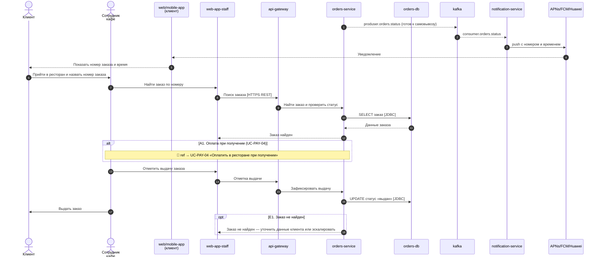

---

## UC-PAY-01 «Выполнить оплату заказа»

[↑ Реестр](../README.md#-реестр-вариантов-использования)

### Карточка варианта использования

|                   |                                                         |
|-------------------|---------------------------------------------------------|
| **Идентификатор** | UC-PAY-01                                               |
| **Название**      | Выполнить оплату заказа                                 |
| **Триггер**       | В процессе оформления заказа клиент переходит к оплате. |

### Условия завершения

<table>
<colgroup>
<col style="width: 31%" />
<col style="width: 68%" />
</colgroup>
<tbody>
<tr class="odd">
<td><strong>Предусловия</strong></td>
<td>
P1. Сформирован заказ с финальной суммой.

P2. Клиенту доступен хотя бы один способ оплаты для выбранного
способа получения.
</td>
</tr>
<tr class="even">
<td><strong>Минимальные гарантии</strong></td>
<td>
MG1. При неопределённом результате оплаты повторное списание не
выполняется до сверки статуса операции.

MG2. Заказ, не имеющий подтверждённой оплаты (для способов с
предоплатой), не передаётся в производство.

MG3. Все платёжные операции журналируются со сквозным
идентификатором.
</td>
</tr>
<tr class="odd">
<td><strong>Гарантии успеха</strong></td>
<td>
SG1. Платёж по заказу подтверждён выбранным способом и связан с
заказом.

SG2. Заказу присвоен статус оплаты, позволяющий его дальнейшую
обработку и выдачу.
</td>
</tr>
</tbody>
</table>

### Основной успешный сценарий

| **Шаг** | **Инициатор** | **Действие / наблюдаемый результат**                                                                          |
|---------|---------------|---------------------------------------------------------------------------------------------------------------|
| **1**   | Система       | Отображает доступные способы оплаты для выбранного способа получения.                                         |
| **2**   | Клиент        | Выбирает способ оплаты: онлайн, курьеру или в ресторане при получении.                                        |
| **3**   | Система       | Направляет клиента в соответствующий поток оплаты (UC-PAY-02/03/04).                                          |
| **4**   | Клиент        | Выполняет оплату выбранным способом.                                                                          |
| **5**   | Система       | Получает подтверждение платежа, связывает его с заказом и фиксирует статус оплаты. Use Case успешно завершён. |

### Альтернативные потоки

| **Код и название**         | **Точка ветвления** | **Условие**                               | **Шаги**                                         | **Возврат / завершение**       |
|----------------------------|---------------------|-------------------------------------------|--------------------------------------------------|--------------------------------|
| **A1. Оплата онлайн**      | Шаг 2               | Клиент выбрал онлайн-оплату               | A1.1. Выполняется UC-PAY-02.                     | Успешное завершение по шагу 5. |
| **A2. Оплата курьеру**     | Шаг 2               | Заказ на доставку, выбрана оплата курьеру | A2.1. Выполняется UC-PAY-03 при передаче заказа. | Успешное завершение по шагу 5. |
| **A3. Оплата в ресторане** | Шаг 2               | Самовывоз, выбрана оплата при получении   | A3.1. Выполняется UC-PAY-04 при выдаче.          | Успешное завершение по шагу 5. |

### Потоки исключений

| **Код и название**               | **Точка возникновения** | **Ошибка / причина**                | **Реакция системы**                                                                                        | **Результат**                                                             |
|----------------------------------|-------------------------|-------------------------------------|------------------------------------------------------------------------------------------------------------|---------------------------------------------------------------------------|
| **E1. Оплата отклонена**         | Шаг 4                   | Провайдер вернул отказ (для онлайн) | E1.1. Система не создаёт оплаченный заказ и предлагает повторить или сменить способ.                       | Возврат к шагу 2.                                                         |
| **E2. Статус оплаты неизвестен** | Шаг 5                   | Тайм-аут после отправки платежа     | E2.1. Система блокирует повторную оплату этой попытки, запрашивает статус операции и журналирует инцидент. | После подтверждения успеха — завершение; после отказа — возврат к шагу 2. |

### Sequence-диаграмма

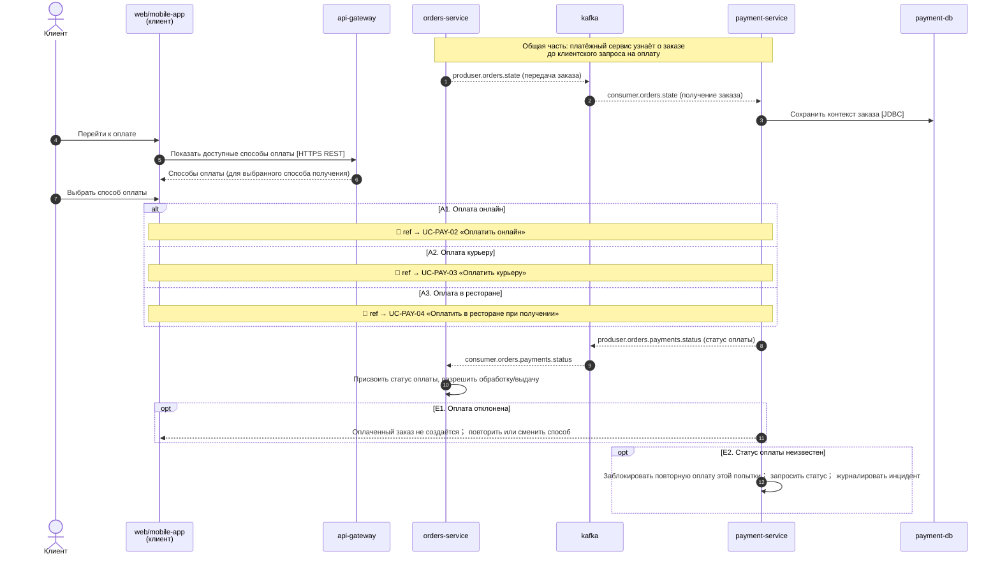

---

## UC-PAY-02 «Оплатить онлайн»

[↑ Реестр](../README.md#-реестр-вариантов-использования)

### Карточка варианта использования

|                   |                                                    |
|-------------------|----------------------------------------------------|
| **Идентификатор** | UC-PAY-02                                          |
| **Название**      | Оплатить онлайн                                    |
| **Триггер**       | Клиент выбрал онлайн-оплату при оформлении заказа. |

### Условия завершения

<table>
<colgroup>
<col style="width: 31%" />
<col style="width: 68%" />
</colgroup>
<tbody>
<tr class="odd">
<td><strong>Предусловия</strong></td>
<td>
P1. Заказ сформирован, сумма определена.

P2. Доступен платёжный провайдер.
</td>
</tr>
<tr class="even">
<td><strong>Минимальные гарантии</strong></td>
<td>
MG1. При неизвестном статусе платежа повторное списание не
выполняется до сверки.

MG2. Полные реквизиты карты не сохраняются.
</td>
</tr>
<tr class="odd">
<td><strong>Гарантии успеха</strong></td>
<td>SG1. Онлайн-платёж подтверждён и связан с заказом; заказ помечен
оплаченным.</td>
</tr>
</tbody>
</table>

### Основной успешный сценарий

| **Шаг** | **Инициатор** | **Действие / наблюдаемый результат**                                                            |
|---------|---------------|-------------------------------------------------------------------------------------------------|
| **1**   | Клиент        | Подтверждает онлайн-оплату и вводит платёжные данные в защищённой форме провайдера.             |
| **2**   | Система       | Инициирует платёж у провайдера со сквозным идентификатором.                                     |
| **3**   | Система       | Получает подтверждение успешной оплаты и фиксирует статус «оплачен». Use Case успешно завершён. |

### Альтернативные потоки

*Не применимо: у данного варианта использования нет самостоятельных
альтернативных путей достижения цели.*

### Потоки исключений

| **Код и название**        | **Точка возникновения** | **Ошибка / причина**   | **Реакция системы**                                                                             | **Результат**                                   |
|---------------------------|-------------------------|------------------------|-------------------------------------------------------------------------------------------------|-------------------------------------------------|
| **E1. Платёж отклонён**   | Шаг 2                   | Провайдер вернул отказ | E1.1. Система показывает причину в допустимом объёме и предлагает повторить или сменить способ. | Возврат к выбору способа оплаты (UC-PAY-01).    |
| **E2. Статус неизвестен** | Шаг 2                   | Тайм-аут провайдера    | E2.1. Система блокирует повторную оплату этой попытки и запрашивает статус операции.            | После сверки — завершение или возврат к оплате. |

### Sequence-диаграмма

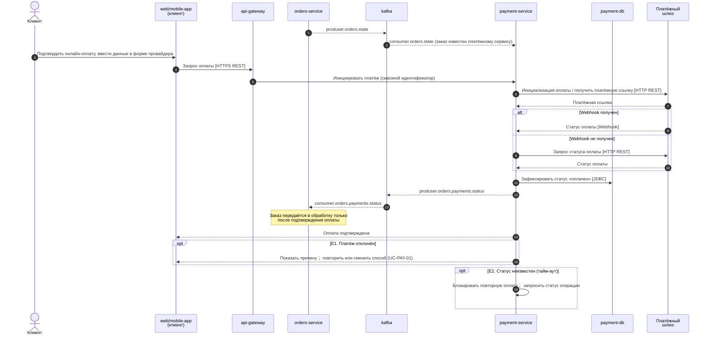

---

## UC-PAY-03 «Оплатить курьеру»

[↑ Реестр](../README.md#-реестр-вариантов-использования)

### Карточка варианта использования

|                   |                                                                             |
|-------------------|-----------------------------------------------------------------------------|
| **Идентификатор** | UC-PAY-03                                                                   |
| **Название**      | Оплатить курьеру                                                            |
| **Триггер**       | Курьер передаёт заказ клиенту при доставке, выбран способ «оплата курьеру». |

### Условия завершения

<table>
<colgroup>
<col style="width: 31%" />
<col style="width: 68%" />
</colgroup>
<tbody>
<tr class="odd">
<td><strong>Предусловия</strong></td>
<td>
P1. Заказ на доставку, выбран способ «оплата курьеру».

P2. Курьер прибыл к клиенту с заказом.
</td>
</tr>
<tr class="even">
<td><strong>Минимальные гарантии</strong></td>
<td>MG1. Заказ не отмечается оплаченным без подтверждения приёма оплаты
курьером.</td>
</tr>
<tr class="odd">
<td><strong>Гарантии успеха</strong></td>
<td>SG1. Оплата принята курьером и зафиксирована в системе; заказ
помечен оплаченным и выданным.</td>
</tr>
</tbody>
</table>

### Основной успешный сценарий

| **Шаг** | **Инициатор** | **Действие / наблюдаемый результат**                                |
|---------|---------------|---------------------------------------------------------------------|
| **1**   | Курьер        | Передаёт заказ и запрашивает оплату у клиента.                      |
| **2**   | Клиент        | Оплачивает заказ курьеру.                                           |
| **3**   | Курьер        | Подтверждает приём оплаты в системе.                                |
| **4**   | Система       | Фиксирует оплату и статус выдачи заказа. Use Case успешно завершён. |

### Альтернативные потоки

*Не применимо: у данного варианта использования нет самостоятельных
альтернативных путей достижения цели.*

### Потоки исключений

| **Код и название**                 | **Точка возникновения** | **Ошибка / причина**       | **Реакция системы**                                                                 | **Результат**                          |
|------------------------------------|-------------------------|----------------------------|-------------------------------------------------------------------------------------|----------------------------------------|
| **E1. Клиент отказался от оплаты** | Шаг 2                   | Клиент не оплачивает заказ | E1.1. Курьер фиксирует отказ; система применяет правило неоплаты и возврата заказа. | Заказ закрывается по правилу неоплаты. |

### Sequence-диаграмма

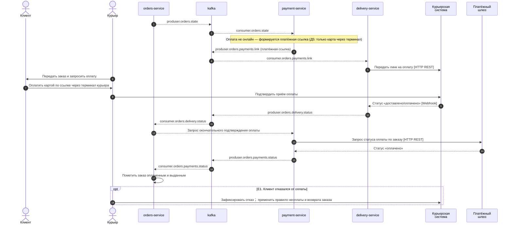

---

## UC-PAY-04 «Оплатить в ресторане при получении»

[↑ Реестр](../README.md#-реестр-вариантов-использования)

### Карточка варианта использования

|                   |                                                                          |
|-------------------|--------------------------------------------------------------------------|
| **Идентификатор** | UC-PAY-04                                                                |
| **Название**      | Оплатить в ресторане при получении                                       |
| **Триггер**       | Клиент забирает заказ в ресторане, выбран способ «оплата при получении». |

### Условия завершения

<table>
<colgroup>
<col style="width: 31%" />
<col style="width: 68%" />
</colgroup>
<tbody>
<tr class="odd">
<td><strong>Предусловия</strong></td>
<td>
P1. Заказ на самовывоз, выбран способ «оплата в ресторане».

P2. Клиент прибыл за заказом.
</td>
</tr>
<tr class="even">
<td><strong>Минимальные гарантии</strong></td>
<td>MG1. Заказ не выдаётся без приёма оплаты при данном способе.</td>
</tr>
<tr class="odd">
<td><strong>Гарантии успеха</strong></td>
<td>SG1. Оплата принята в ресторане и зафиксирована; заказ помечен
оплаченным и выданным.</td>
</tr>
</tbody>
</table>

### Основной успешный сценарий

| **Шаг** | **Инициатор**       | **Действие / наблюдаемый результат**             |
|---------|---------------------|--------------------------------------------------|
| **1**   | Клиент              | Называет номер заказа и переходит к оплате.      |
| **2**   | Сотрудник ресторана | Принимает оплату через кассовую систему.         |
| **3**   | Система             | Фиксирует оплату и разрешает выдачу заказа.      |
| **4**   | Сотрудник ресторана | Выдаёт заказ клиенту. Use Case успешно завершён. |

### Альтернативные потоки

*Не применимо: у данного варианта использования нет самостоятельных
альтернативных путей достижения цели.*

### Потоки исключений

| **Код и название**       | **Точка возникновения** | **Ошибка / причина**    | **Реакция системы**                                                         | **Результат**  |
|--------------------------|-------------------------|-------------------------|-----------------------------------------------------------------------------|----------------|
| **E1. Оплата не прошла** | Шаг 2                   | Отказ кассовой операции | E1.1. Сотрудник предлагает иной способ оплаты; заказ не выдаётся до оплаты. | Повтор шага 2. |

### Sequence-диаграмма

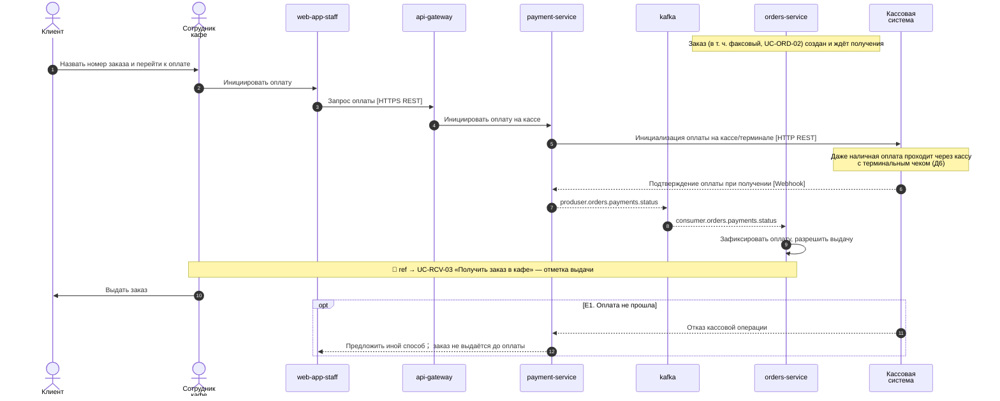

---

## UC-MAP-01 «Просмотреть пробки и дорожную ситуацию»

[↑ Реестр](../README.md#-реестр-вариантов-использования)

### Карточка варианта использования

|                   |                                                                           |
|-------------------|---------------------------------------------------------------------------|
| **Идентификатор** | UC-MAP-01                                                                 |
| **Название**      | Просмотреть пробки и дорожную ситуацию                                    |
| **Триггер**       | Клиент запрашивает информацию о пробках и дорожной ситуации до ресторана. |

### Условия завершения

<table>
<colgroup>
<col style="width: 31%" />
<col style="width: 68%" />
</colgroup>
<tbody>
<tr class="odd">
<td><strong>Предусловия</strong></td>
<td>
P1. Выбран ресторан (UC-FND-01).

P2. Доступен хотя бы один внешний картографический сервис.
</td>
</tr>
<tr class="even">
<td><strong>Минимальные гарантии</strong></td>
<td>MG1. При недоступности всех сервисов клиенту явно сообщается об
отсутствии данных, а не показываются устаревшие как актуальные.</td>
</tr>
<tr class="odd">
<td><strong>Гарантии успеха</strong></td>
<td>SG1. Клиенту показана актуальная дорожная ситуация и пробки на пути
к ресторану.</td>
</tr>
</tbody>
</table>

### Основной успешный сценарий

| **Шаг** | **Инициатор** | **Действие / наблюдаемый результат**                                                              |
|---------|---------------|---------------------------------------------------------------------------------------------------|
| **1**   | Клиент        | Запрашивает дорожную ситуацию до выбранного ресторана.                                            |
| **2**   | Система       | Обращается к внешним картографическим сервисам за данными о пробках.                              |
| **3**   | Система       | Отображает карту с текущей дорожной ситуацией и уровнем загруженности. Use Case успешно завершён. |

### Альтернативные потоки

| **Код и название**             | **Точка ветвления** | **Условие**                 | **Шаги**                                                          | **Возврат / завершение** |
|--------------------------------|---------------------|-----------------------------|-------------------------------------------------------------------|--------------------------|
| **A1. Смена источника данных** | Шаг 2               | Основной сервис не отвечает | A1.1. Система переключается на резервный картографический сервис. | Продолжить с шага 3.     |

### Потоки исключений

| **Код и название**        | **Точка возникновения** | **Ошибка / причина**                    | **Реакция системы**                                                                 | **Результат**                    |
|---------------------------|-------------------------|-----------------------------------------|-------------------------------------------------------------------------------------|----------------------------------|
| **E1. Данные недоступны** | Шаг 2                   | Все картографические сервисы недоступны | E1.1. Система сообщает об отсутствии данных о пробках и предлагает повторить позже. | Use Case завершён с деградацией. |

### Sequence-диаграмма

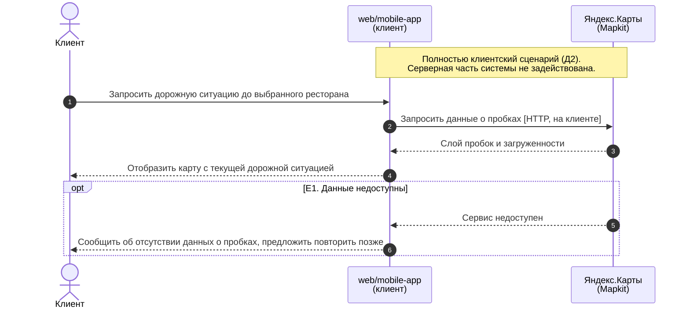

---

## UC-MAP-02 «Построить маршрут до ресторана»

[↑ Реестр](../README.md#-реестр-вариантов-использования)

### Карточка варианта использования

|                   |                                                                                                      |
|-------------------|------------------------------------------------------------------------------------------------------|
| **Идентификатор** | UC-MAP-02                                                                                            |
| **Название**      | Построить маршрут до ресторана                                                                       |
| **Триггер**       | Клиент запрашивает маршрут до ресторана (расширение UC-MAP-01), в том числе после оформления заказа. |

### Условия завершения

<table>
<colgroup>
<col style="width: 31%" />
<col style="width: 68%" />
</colgroup>
<tbody>
<tr class="odd">
<td><strong>Предусловия</strong></td>
<td>
P1. Выбран ресторан и известно местоположение клиента или точка
старта.

P2. Доступен картографический сервис маршрутизации.
</td>
</tr>
<tr class="even">
<td><strong>Минимальные гарантии</strong></td>
<td>MG1. Клиенту не предлагается заведомо недействительный маршрут при
отсутствии данных.</td>
</tr>
<tr class="odd">
<td><strong>Гарантии успеха</strong></td>
<td>SG1. Клиенту построен и показан маршрут до ресторана с
ориентировочным временем в пути.</td>
</tr>
</tbody>
</table>

### Основной успешный сценарий

| **Шаг** | **Инициатор** | **Действие / наблюдаемый результат**                                                      |
|---------|---------------|-------------------------------------------------------------------------------------------|
| **1**   | Клиент        | Запрашивает построение маршрута до ресторана.                                             |
| **2**   | Система       | Запрашивает маршрут у картографического сервиса с учётом дорожной ситуации.               |
| **3**   | Система       | Отображает маршрут, расстояние и ориентировочное время в пути. Use Case успешно завершён. |

### Альтернативные потоки

| **Код и название**                      | **Точка ветвления** | **Условие**                             | **Шаги**                                                                  | **Возврат / завершение** |
|-----------------------------------------|---------------------|-----------------------------------------|---------------------------------------------------------------------------|--------------------------|
| **A1. Маршрут после оформления заказа** | Шаг 1               | Клиент оформил заказ и запросил маршрут | A1.1. Система использует адрес выбранного ресторана как точку назначения. | Продолжить с шага 2.     |

### Потоки исключений

| **Код и название**          | **Точка возникновения** | **Ошибка / причина**            | **Реакция системы**                                                                                               | **Результат**                    |
|-----------------------------|-------------------------|---------------------------------|-------------------------------------------------------------------------------------------------------------------|----------------------------------|
| **E1. Маршрут не построен** | Шаг 2                   | Сервис маршрутизации недоступен | E1.1. Система переключается на резервный сервис; при общей недоступности показывает адрес и предлагает повторить. | Возврат к шагу 1 или деградация. |

### Sequence-диаграмма

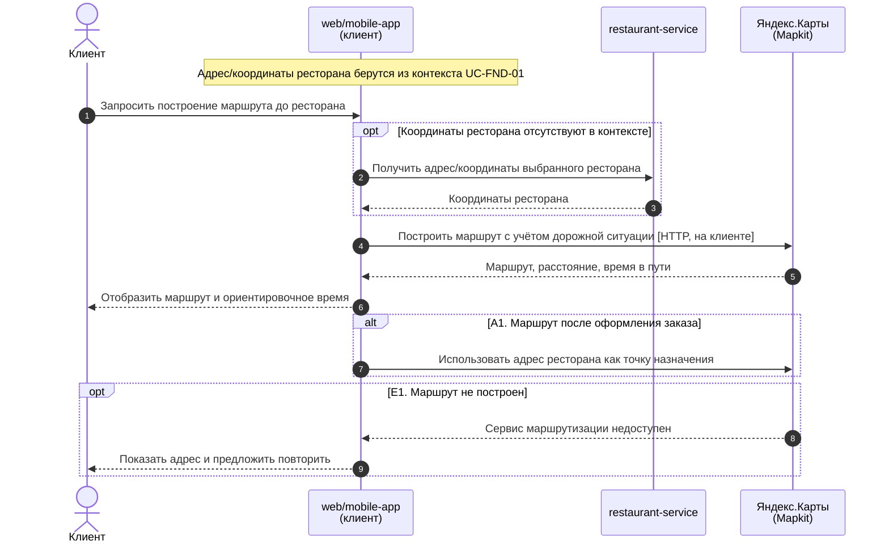

---

## UC-PRM-02 «Управлять акциями и специальными предложениями»

[↑ Реестр](../README.md#-реестр-вариантов-использования)

### Карточка варианта использования

|                   |                                                                                                |
|-------------------|------------------------------------------------------------------------------------------------|
| **Идентификатор** | UC-PRM-02                                                                                      |
| **Название**      | Управлять акциями и специальными предложениями                                                 |
| **Триггер**       | Сотрудник открывает раздел управления акциями и инициирует создание или изменение предложения. |

### Условия завершения

<table>
<colgroup>
<col style="width: 31%" />
<col style="width: 68%" />
</colgroup>
<tbody>
<tr class="odd">
<td><strong>Предусловия</strong></td>
<td>P1. Сотрудник аутентифицирован и имеет права на управление акциями
соответствующего уровня.</td>
</tr>
<tr class="even">
<td><strong>Минимальные гарантии</strong></td>
<td>
MG1. Сотрудник не может изменить акцию вне зоны своих полномочий
(локальную/общенациональную).

MG2. Некорректно заданная акция не публикуется клиентам.
</td>
</tr>
<tr class="odd">
<td><strong>Гарантии успеха</strong></td>
<td>
SG1. Акция создана/изменена/завершена и, при активации,
опубликована целевой аудитории.

SG2. История изменения акции сохранена.
</td>
</tr>
</tbody>
</table>

### Основной успешный сценарий

| **Шаг** | **Инициатор** | **Действие / наблюдаемый результат**                                                                      |
|---------|---------------|-----------------------------------------------------------------------------------------------------------|
| **1**   | Сотрудник     | Открывает управление акциями и выбирает создание или изменение предложения.                               |
| **2**   | Система       | Проверяет полномочия и отображает форму с параметрами акции (условия, период, применимые позиции, охват). |
| **3**   | Сотрудник     | Задаёт параметры акции соответствующего уровня (локального или общенационального).                        |
| **4**   | Система       | Валидирует параметры и правила приоритета акций.                                                          |
| **5**   | Сотрудник     | Активирует акцию.                                                                                         |
| **6**   | Система       | Публикует акцию целевой аудитории клиентов и фиксирует изменение. Use Case успешно завершён.              |

### Альтернативные потоки

| **Код и название**                           | **Точка ветвления** | **Условие**                                                   | **Шаги**                                                                    | **Возврат / завершение**       |
|----------------------------------------------|---------------------|---------------------------------------------------------------|-----------------------------------------------------------------------------|--------------------------------|
| **A1. Управление локальными акциями**        | Шаг 3               | Актор — владелец ресторана (специализация UC-PRM-03)          | A1.1. Область действия акции ограничена конкретным рестораном франшизы.     | Продолжить с шага 4.           |
| **A2. Управление общенациональными акциями** | Шаг 3               | Актор — сотрудник головной компании (специализация UC-PRM-04) | A2.1. Область действия акции распространяется на всю сеть.                  | Продолжить с шага 4.           |
| **A3. Завершение акции**                     | Шаг 3               | Сотрудник завершает действующую акцию                         | A3.1. Система переводит акцию в статус «Завершена» и прекращает публикацию. | Успешное завершение по шагу 6. |

### Потоки исключений

| **Код и название**            | **Точка возникновения** | **Ошибка / причина**                              | **Реакция системы**                                                                 | **Результат**                   |
|-------------------------------|-------------------------|---------------------------------------------------|-------------------------------------------------------------------------------------|---------------------------------|
| **E1. Недостаточно прав**     | Шаг 2                   | Уровень акции вне полномочий сотрудника           | E1.1. Система отклоняет действие и журналирует попытку.                             | Отмена; возврат к списку акций. |
| **E2. Конфликт правил акций** | Шаг 4                   | Новая акция конфликтует с приоритетом действующих | E2.1. Система сообщает о конфликте и требует скорректировать условия или приоритет. | Возврат к шагу 3.               |

### Sequence-диаграмма

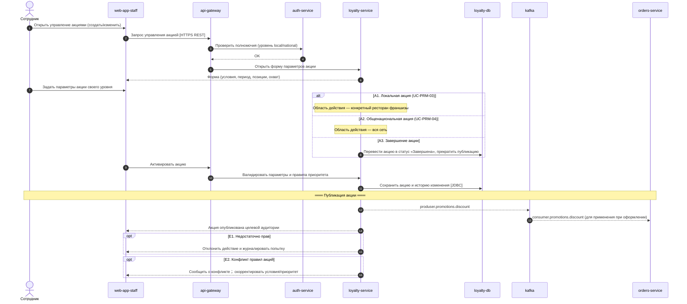

---

## UC-PRM-03 «Управлять локальными акциями ресторана»

[↑ Реестр](../README.md#-реестр-вариантов-использования)

### Карточка варианта использования

|                   |                                                                              |
|-------------------|------------------------------------------------------------------------------|
| **Идентификатор** | UC-PRM-03                                                                    |
| **Название**      | Управлять локальными акциями ресторана                                       |
| **Триггер**       | Владелец ресторана открывает управление локальными акциями своего ресторана. |

### Условия завершения

|                          |                                                                                         |
|--------------------------|-----------------------------------------------------------------------------------------|
| **Предусловия**          | P1. Владелец аутентифицирован и привязан к конкретному ресторану франшизы.              |
| **Минимальные гарантии** | MG1. Область действия локальной акции не может выходить за пределы ресторана владельца. |
| **Гарантии успеха**      | SG1. Локальная акция создана/изменена и опубликована клиентам данного ресторана.        |

### Основной успешный сценарий

| **Шаг** | **Инициатор**      | **Действие / наблюдаемый результат**                                                                |
|---------|--------------------|-----------------------------------------------------------------------------------------------------|
| **1**   | Владелец ресторана | Открывает управление локальными акциями своего ресторана.                                           |
| **2**   | Система            | Проверяет привязку владельца к ресторану и отображает параметры локальной акции.                    |
| **3**   | Владелец ресторана | Задаёт условия, период и применимые позиции акции для своего ресторана.                             |
| **4**   | Система            | Валидирует параметры и активирует акцию, публикуя её клиентам ресторана. Use Case успешно завершён. |

### Альтернативные потоки

| **Код и название**                  | **Точка ветвления** | **Условие**                        | **Шаги**                                               | **Возврат / завершение**       |
|-------------------------------------|---------------------|------------------------------------|--------------------------------------------------------|--------------------------------|
| **A1. Изменение действующей акции** | Шаг 3               | Владелец правит уже активную акцию | A1.1. Система применяет изменения и фиксирует историю. | Успешное завершение по шагу 4. |

### Потоки исключений

| **Код и название**                         | **Точка возникновения** | **Ошибка / причина**              | **Реакция системы**                                                             | **Результат**     |
|--------------------------------------------|-------------------------|-----------------------------------|---------------------------------------------------------------------------------|-------------------|
| **E1. Попытка выйти за пределы ресторана** | Шаг 3                   | Задан охват шире одного ресторана | E1.1. Система запрещает расширение охвата и сообщает об ограничении полномочий. | Возврат к шагу 3. |

### Sequence-диаграмма

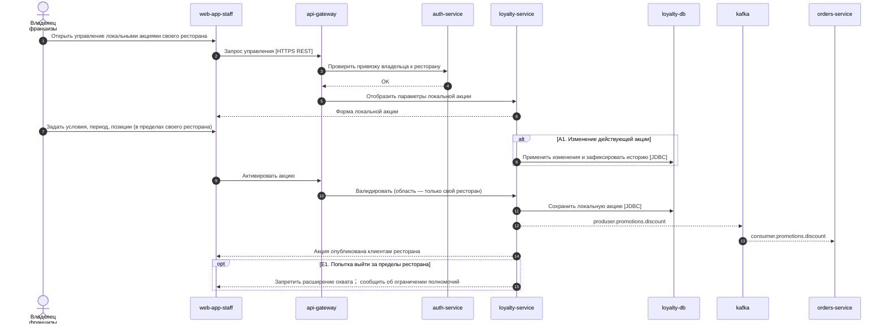

---

## UC-PRM-04 «Управлять общенациональными акциями»

[↑ Реестр](../README.md#-реестр-вариантов-использования)

### Карточка варианта использования

|                   |                                                                             |
|-------------------|-----------------------------------------------------------------------------|
| **Идентификатор** | UC-PRM-04                                                                   |
| **Название**      | Управлять общенациональными акциями                                         |
| **Триггер**       | Сотрудник головной компании открывает управление общенациональными акциями. |

### Условия завершения

|                          |                                                                              |
|--------------------------|------------------------------------------------------------------------------|
| **Предусловия**          | P1. Сотрудник аутентифицирован и имеет права уровня головной компании.       |
| **Минимальные гарантии** | MG1. Общенациональной акцией не может управлять владелец отдельной франшизы. |
| **Гарантии успеха**      | SG1. Общенациональная акция создана/изменена и опубликована во всей сети.    |

### Основной успешный сценарий

| **Шаг** | **Инициатор**               | **Действие / наблюдаемый результат**                                                                           |
|---------|-----------------------------|----------------------------------------------------------------------------------------------------------------|
| **1**   | Сотрудник головной компании | Открывает управление общенациональными акциями.                                                                |
| **2**   | Система                     | Проверяет права уровня головной компании и отображает параметры акции сети.                                    |
| **3**   | Сотрудник головной компании | Задаёт условия, период и охват (вся сеть) акции.                                                               |
| **4**   | Система                     | Валидирует параметры, применяет правила приоритета и активирует акцию во всей сети. Use Case успешно завершён. |

### Альтернативные потоки

| **Код и название**                        | **Точка ветвления** | **Условие**                    | **Шаги**                                                         | **Возврат / завершение**       |
|-------------------------------------------|---------------------|--------------------------------|------------------------------------------------------------------|--------------------------------|
| **A1. Завершение общенациональной акции** | Шаг 3               | Сотрудник завершает акцию сети | A1.1. Система переводит акцию в статус «Завершена» по всей сети. | Успешное завершение по шагу 4. |

### Потоки исключений

| **Код и название**        | **Точка возникновения** | **Ошибка / причина**                   | **Реакция системы**                                     | **Результат**                   |
|---------------------------|-------------------------|----------------------------------------|---------------------------------------------------------|---------------------------------|
| **E1. Недостаточно прав** | Шаг 2                   | Актор не относится к головной компании | E1.1. Система отклоняет действие и журналирует попытку. | Отмена; возврат к списку акций. |

### Sequence-диаграмма

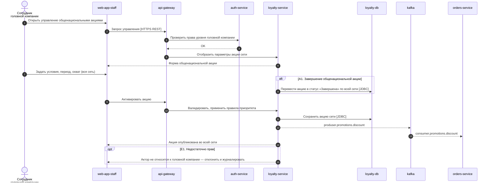

---
